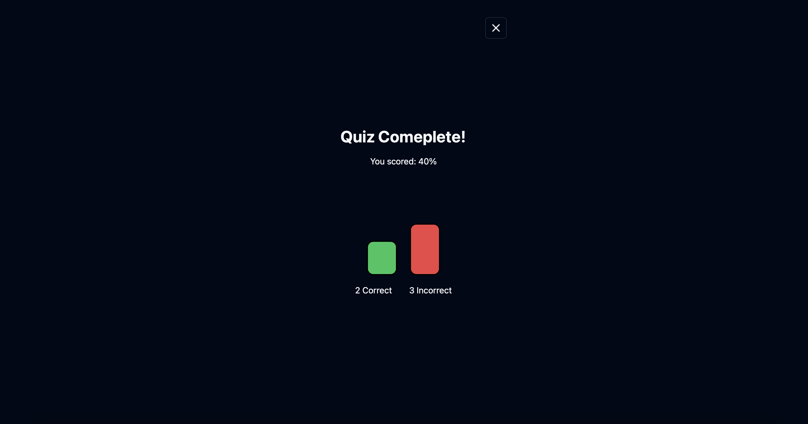

# QuizCrafter

The project that uses AI to generate quizzes.


## Overview

QuizCrafter is a powerful tool designed to automatically create quizzes from provided notes. Utilizing cutting-edge AI technologies, it simplifies the quiz creation process, making it faster and more efficient.

## Glimpse
**Sign in using Google:**

**Generate quizzes based on notes:**

**Complete the AI generated quiz:**



**View your stats:**


## Features

- **AI-Powered Quiz Generation**: Automatically create quizzes based on your input notes.
- **User Authentication**: Secure login and registration with Next-auth.
- **Responsive UI**: User-friendly interface built with Shadcn UI.
- **Flexible Deployment**: Easily deploy your application on Vercel.

## Tech Stack 

- **Next-auth**: Authentication
- **Shadcn UI**: UI Library
- **OpenAI**: AI Integration
- **Langchain**: LLM Framework
- **Drizzle**: ORM
- **PostgreSQL**: Database
- **Supabase**: Database Hosting
- **Stripe**: Payments
- **Tanstack**: Table Management
- **TypeScript**: Type Checking
- **Vercel**: Deployment
- **Zod**: Schema Validation

## Getting Started

### Prerequisites

Ensure you have the following installed:
- Node.js
- npm, yarn, pnpm, or bun

### Installation

1. Clone the repository:
   ```bash
   git clone https://github.com/yourusername/ai-quiz-generator.git
   cd ai-quiz-generator
   ```

2. Install dependencies:
   ```bash
   npm install
   # or
   yarn install
   # or
   pnpm install
   # or
   bun install
   ```

### Running the Development Server

Start the development server:
```bash
npm run dev
# or
yarn dev
# or
pnpm dev
# or
bun dev
```

Open [http://localhost:3000](http://localhost:3000) with your browser to see the result.

You can start editing the page by modifying `app/page.tsx`. The page auto-updates as you edit the file.

### Environment Variables

Create a new `.env` file and add your keys as follows:
```
OPENAI_API_KEY=""
GOOGLE_CLIENT_ID=""
GOOGLE_CLIENT_SECRET=""
AUTH_SECRET=""
DATABASE_URL=""
NEXT_PUBLIC_PUBLISHABLE_KEY=""
STRIPE_SECRET_KEY=""
STRIPE_WEBHOOK_SECRET=""
STRIPE_WEBHOOK_LOCAL_SECRET=""
```

## Acknowledgments

- Thanks to [OpenAI](https://openai.com) for their amazing API.
